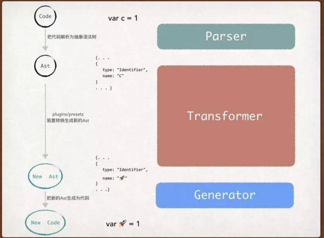

# babel的运行原理


## 一、解析

解析步骤接收代码并输出 AST。 这个步骤分为两个阶段：词法分析（Lexical Analysis） 和 语法分析（Syntactic Analysis）

1. 词法分析
 
词法分析阶段把字符串形式的代码转换为`令牌（tokens）流`。

可以把令牌看作是一个扁平的语法片段数组：

```js
  n * n;
```

```js
  [
    { type: { ... }, value: "n", start: 0, end: 1, loc: { ... } },
    { type: { ... }, value: "*", start: 2, end: 3, loc: { ... } },
    { type: { ... }, value: "n", start: 4, end: 5, loc: { ... } },
    ...
  ]
```

每一个 type 有一组属性来描述该令牌：

```js
{
  type: {
    label: 'name',
    keyword: undefined,
    beforeExpr: false,
    startsExpr: true,
    rightAssociative: false,
    isLoop: false,
    isAssign: false,
    prefix: false,
    postfix: false,
    binop: null,
    updateContext: null
  },
  ...
}
```

2. 语法分析

语法分析阶段会把一个令牌流转换成 AST 的形式。 这个阶段会使用令牌中的信息把它们转换成一个 AST 的表述结构，这样更易于后续的操作。

简单来说，解析阶段就是

```js
  code(字符串形式代码) -> tokens(令牌流) -> AST（抽象语法树）
```

Babel 使用 @babel/parser 解析代码，输入的 js 代码字符串根据 ESTree 规范生成 AST（抽象语法树）。Babel 使用的解析器是 babylon。

## 二、转换

转换步骤接收 AST 并对其进行遍历，在此过程中对节点进行添加、更新及移除等操作。 这是 Babel 或是其他编译器中最复杂的过程。

Babel提供了@babel/traverse(遍历)方法维护这AST树的整体状态，并且可完成对其的替换，删除或者增加节点，这个方法的参数为原始AST和自定义的转换规则，返回结果为转换后的AST。

## 三、生成

代码生成步骤把最终（经过一系列转换之后）的 AST 转换成字符串形式的代码，同时还会创建源码映射（source maps）。

代码生成其实很简单：深度优先遍历整个 AST，然后构建可以表示转换后代码的字符串。

Babel使用 @babel/generator 将修改后的 AST 转换成代码，生成过程可以对是否压缩以及是否删除注释等进行配置，并且支持 sourceMap。



[](https://juejin.cn/post/6844903760603398151)