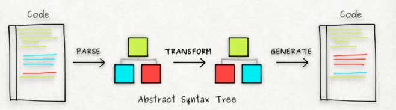

# 了解babel

## 如何解释 React 是什么？/ 谈一谈你对 React 的理解？

对待这类概念题，讲究一个四字口诀“讲说理列”，即“讲概念，说用途，理思路，优缺点，列一遍” 

1. Babel是一个JavaScript编译器，主要用于将ES2015+版本的代码转换为向后兼容的JavaScript语法，可以使javascript能够运行在程度不同的浏览器，而不用考虑如何进行向后兼容。

2. babel的运行原理分为3个部分，解析 -> 转换 -> 生成；
   
   - 解析阶段主要接受代码并且输出AST，主要分为词法分析（Lexical Analysis） 和 语法分析（Syntactic Analysis）两个部分。（Babel 使用 @babel/parser 解析代码）
   - 转换阶段主要是接收 AST 并对其进行遍历，在此过程中对节点进行添加、更新及移除等操作（Babel提供了@babel/traverse(遍历)方法）
   - 代码生成步骤把最终（经过一系列转换之后）的 AST 转换成字符串形式的代码，同时还会创建源码映射（source maps）（Babel使用 @babel/generator 将修改后的 AST 转换成代码）

