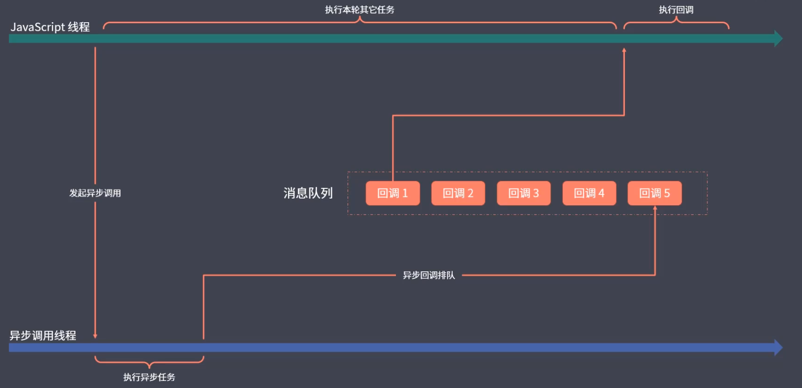

# 同步模式 Synchronous

同步模式：多个任务等待执行的过程当中，后一个任务需要等待前一个任务执行完毕之后在执行，程序的执行顺序跟代码的顺序是一致的，同步不代表同时，而是排队执行，把全部的代码压入执行栈，放在一个匿名函数当中执行

# 异步模式 Asynchronous

异步模式： 不会等待这个任务的结束才开始下一个任务，一个任务执行开启过后立即往后执行下一个任务，耗时任务的后续逻辑一般会通过回调函数的方式定义，耗时任务执行完毕之后就会执行回掉函数，如果没有异步模式，单线程的javaScript语言就无法同时处理大量耗时任务。

JavaScript某一个时刻发起一个任务，异步线程会单独的执行这个异步任务，执行完毕之后会将这个任务放在消息队列当中，js主线程完成全部的任务过后，会在一次执行我们的消息队列当中的任务

# 回调函数

回调函数可以理解为一件你想要做的事，但是你不知道这件事儿依赖的任务什么时候执行完，所以将这些行为封装成一个函数，当任务执行完毕之后在执行这些行为，即由调用者定义，交给执行者执行的函数就称为回调函数

