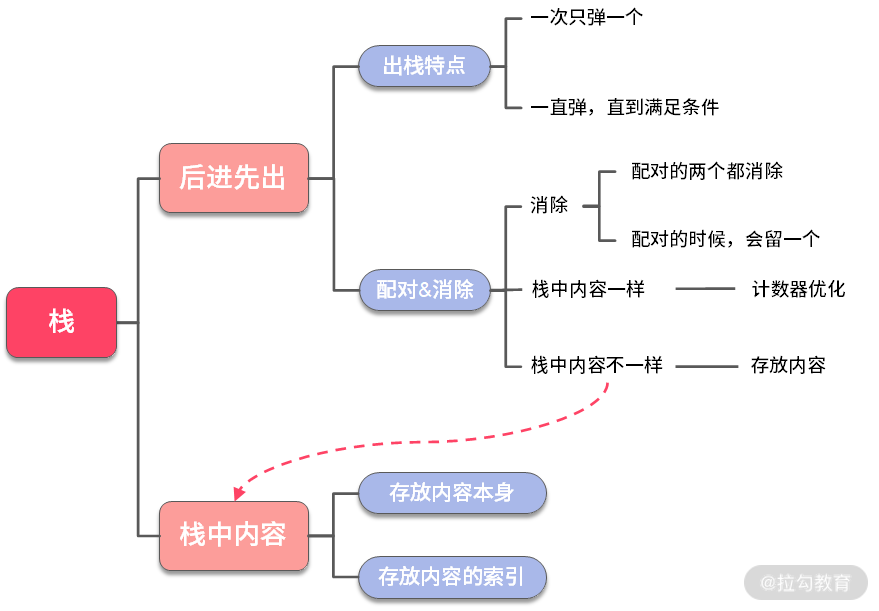

# 栈

## 基础知识了解

简单栈的特点可以用一句话来概括，**先进后出（LIFO）**顺序，类似于javascript当中的数组，出栈入栈的操作类似于push、pop的操作

首先，分析题目的时候，要特别注意以下4点，归纳为“四步分析法”

- 1. **模拟：模拟题目运行**
- 2. **规律：倡议总结出题目的一般规律和特点**
- 3. **匹配：找到符合这些特点的数据结构和算法**
- 4. **边界：考虑特殊情况**

## 栈的使用场景

需要后进先出的场景；例如：十进制转二进制、判断字符串的括号是否有效、函数调用堆栈等

### 例 1：判断字符串括号是否合法

**【题目】**字符串中只有字符'('和')'。合法字符串需要括号可以配对，比如：

输入："()"

输出：true

解释：()，()()，(())是合法的。)(，()(，(()是非法的。

请你实现一个函数，来判断给定的字符串是否合法

```js
((((())))) // valid
()()() // valid
(() // invalid
```

接下来我们就按照上面的步骤来拆解题目。

1. 模拟

首先我们以字符串 s = "()()(())"，进行模拟，如下动图所示：

2. 规律

我们回顾一下模拟过程，可以总结出以下 3 个特点。

（1）每个左括号'('或者右括号')'都完成**配对**，才是合法的。

（2）配对可以通过**消除法**来消掉合法的括号，如果最后没有任何字符了，那么就是合法字符串。

（3）奇数长度的字符串总是非法的。

3. 匹配

到这里，我们已经弄清楚题目考核的重点，就是**消除法**的模拟。如果仔细观察消除法的行为模式，你会发现，在消除的时候，上图中**红色**的部分和**栈的行为**非常像。因此，可以用栈来进行消除法的模拟。

4. 边界

当我们找到问题匹配的算法或者数据结构之后，一定要记住，接下来一步并不是马上写代码，而是要考虑一些边界问题，也就是一些特殊情况：

- 字符串为空

- 字符串只有 1 个或者奇数个

- 字符串是"(((())))"嵌套很多层的是否可以处理

5. 代码

```js
var isValid = function(s) {
    if (s === '') return true

    if (s.length % 2 === 1) return false

    var stack = []

    for (let item of s) {
        if (item === '(') {
            stack.push(item)
        } else {
            const lastItem = stack[stack.length - 1]
            if (
                lastItem === '(' && item === ')'
            ) {
                stack.pop()
            } else {
                return false
            }
        }
    }
    return !(stack.length)
};
```

6. 思考

+ 深度扩展

如果仔细观察，你会发现，栈中存放的元素是一样的。全部都是左括号'('，除此之外，再也没有别的元素，优化方法如下。

**栈中元素都相同时，实际上没有必要使用栈，只需要记录栈中元素个数。** 

【代码如下】

```js
function isValid(s) {
    if (s === null || s.length === 0) {
        return true;
    }
    if (s.length % 2 === 1) {
        return false;
    }
    let leftBraceNumber = 0
    for (let i = 0; i < s.length; i++) {
        if (s[i] === '(') {
            leftBraceNumber++
        }  else if (s[i] === ')') {
            if (leftBraceNumber <= 0) {
                // 如果弹栈失败，那么返回false
                return false;
            }
            --leftBraceNumber;
        }
    }
    return leftBraceNumber == 0;
}
```

+ 广度扩展

【题目扩展】给定一个只包括 '('，')'，'{'，'}'，'['，']' 的字符串，判断字符串是否有效。有效字符串需满足：

1. 左括号必须用相同类型的右括号闭合

2. 左括号必须以正确的顺序闭合

3. 注意空字符串可被认为是有效字符串

```js
var isValid = function(s) {
    if (s === '') return true

    if (s.length % 2 === 1) return false

    var stack = []

    for (let item of s) {
        if (item === '[' || item === '(' || item === '{') {
            stack.push(item)
        } else {
            const lastItem = stack[stack.length - 1]
            if (
                lastItem === '[' && item === ']' || 
                lastItem === '(' && item === ')' || 
                lastItem === '{' && item === '}'
            ) {
                stack.pop()
            } else {
                return false
            }
        }
    }
    return !(stack.length)
};
```

**【小结】**接下来，我们对拓展题目进行总结，希望你从中提炼出经验，以后再遇到相似的题目能够轻松应对。


### 例 2：大鱼吃小鱼

【题目】在水中有许多鱼，可以认为这些鱼停放在 x 轴上。再给定两个数组 Size，Dir，Size[i] 表示第 i 条鱼的大小，Dir[i] 表示鱼的方向 （0 表示向左游，1 表示向右游）。这两个数组分别表示鱼的大小和游动的方向，并且两个数组的长度相等。鱼的行为符合以下几个条件:

1. 所有的鱼都同时开始游动，每次按照鱼的方向，都游动一个单位距离；

2. 当方向相对时，大鱼会吃掉小鱼；

3. 鱼的大小都不一样。

输入：Size = [4, 2, 5, 3, 1], Dir = [1, 1, 0, 0, 0]

输出：3

```js
// 栈中存储内容 + 递归解法

function solution(fishSize = [], fishDirection = [])  {
   if (fishSize.length === 0) return 0

   if (fishDirection.length === 0) return fishSize.length

   let stack = []

   function compareFish(i) {
        if (stack.length === 0) {
            stack.push({ stackTopSize: fishSize[i], stackTopDir: fishDirection[i] })
            return
        }
        let { stackTopSize, stackTopDir } = stack[stack.length - 1]
        if (stackTopDir === fishDirection[i]) {
            stack.push({ stackTopSize: fishSize[i], stackTopDir: fishDirection[i] })
        } else {
            if (stackTopSize < fishSize[i]) {
                stack.pop()
                compareFish(i)
            }
        }  
   }

    for (let i = 0; i < fishSize.length; i++) {
        compareFish(i)
    }

    return stack.length
}

// 栈中存储内容的索引，利用while循环
function solution(fishSize = [], fishDirection = [])  {

    if (fishSize.length === 0) return 0

    if (fishDirection.length === 0) return fishSize.length

    let stack = []

    for (let i = 0; i < fishSize.length; i++) {
        let curFishSize = fishSize[i]
        let curFishDir = fishDirection[i]

        let hasEat = false

        while(stack.length && curFishDir !== fishDirection[stack[stack.length - 1]]) {
            if (fishSize[stack[stack.length - 1]] > curFishSize) {
                hasEat = true;
                break;
            }
            stack.pop()
        }

        if (!hasEat) {
            stack.push(i)
        }
    }

    return stack.length
}
```

**【小结】**接下来我们一起对这道题做一下归纳。可以发现，与例 1 相比，它们的消除行为有所不同：

在例 1 中，消除行为表现为配对的**两者都会消除**；

在例 2 中，消除行为表现为配对的两者中**有一个会被消除**。



## 单调栈的阶梯技巧

**单调栈的定义：**单调栈就是指栈中的元素**必须**是按照**升序**排列的栈，或者是**降序**排列的栈。对于这两种排序方式的栈，还给它们各自取了小名。

升序排列的栈称为**递增栈**，降序排列的栈称为**递减栈**

单调栈的特点：有序性，一句话：“**任何时候都需要保证栈的有序性**”

**单调栈的特点：**


### 例题

**例 3：找出数组中右边比我小的元素**

**【题目】**一个整数数组 A，找到每个元素：右边第一个比我小的下标位置，没有则用 -1 表示。

输入：[5, 2]

输出：[1, -1]

**解释：**因为元素 5 的右边离我最近且比我小的位置应该是 A[1]，最后一个元素 2 右边没有比 2 小的元素，所以应该输出 -1。

1. 【规律】这时可以总结出：一个数总是想与左边比它大的数进行匹配，匹配到了之后，小的数会消除掉大的数

2. 【匹配】

当你发现要解决的题目有两个特点：

- 小的数要与大的数配对

- 小的数会消除大的数

这时会想到利用单调栈解决这道题目

3. 【代码】

```js
function findRightSmall(arr) {
    let IndexArr = []

    let stack = []

    for (let i = 0; i < arr.length; i++) {
        const stackTopIndex= stack[stack.length - 1]
        while(stack.length && arr[stackTopIndex] > arr[i]) {
            IndexArr[stackTopIndex] = i
            stack.pop()
        }
        stack.push(i)
    }

    while(stack.length) {
        IndexArr[stack[stack.length - 1]] = -1
        stack.pop()
    }
    return IndexArr
}
```

4. 【小结】到这里我们可以得到一个有趣且非常有用的结论：数组中右边第一个比我小的元素的位置，求解用递增栈。
   
如果我们进一步归纳，会发现消除的时候，这里仍然是消除一个元素，保留一个元素。弹栈的时候，仍然是一直弹栈，直到满足某个条件为止。只是条件变成了直到元素大于栈顶元素。

**例 4：取出最小的数**

**【题目】**给定一个正整数数组和 k，要求依次取出 k 个数，输出其中最小的 k 个。

输入：nums = [3,5,2,6], k = 2

输出：[2,6]

**解释：**在所有可能的解：{[3,5], [3,2], [3,6], [5,2], [5,6], [2,6]} 中，[2,6] 最小。

1. **【规律】**

通过模拟，我们发现**一个特点**：**一旦发现更小的数时，就可以把前面已经放好的数扔掉，然后把这个最小的数放在最前面。**

2. **【匹配】**

到这里，我们已经发现了题目的特点——**较小数消除掉较大数**。根据**例3**总结出来的规律，此时就可以用上单调栈。并且，由于是较小的数消除掉较大的数，所以应该使用**递增栈**。

3. **【边界**】
   
**Case 1：**假设数组右边有一个最小的数，这个最小的数会把左边的数全部都消掉，然后递增栈里面就只剩下这 1 个数了。这跟题意有点不符合，题意需要的是找到 k=2 个出来。

**解决办法：**不过你可以想一想，是不是可以控制一下消去的数目。当剩下的数字个数与栈中的元素刚好能凑够 k 个数时，就不能再消除了

**Case 2：**如果数组是一个升序的数组，那么此时所有的元素都会被压栈。栈中的数目有可能远远超出 k 个。

**解决办法：**只需要把栈中的多出来的数字弹出来即可

4. **【代码】**

```js
function findSmallSeq (A = [], k) {
    let stack = []

    for (let i = 0; i < A.length; i++) {
        while(
            stack.length && 
            stack[stack.length - 1] > A[i] && 
            (stack.length + (A.length - 1 - i)) >= k // 边界值处理
        ) {
            stack.pop()
        }
        stack.push(A[i])
    }
    return stack
}
```

5. **【小结】**写完代码之后，我们需要对代码和题目做一个小结：

- 较小的数消除掉较大的数的时候，使用递增栈；

- 要注意控制剩下的元素的个数；

如果更进一步推而广之，会发现从简单栈到单调栈，层层推进的过程中，不停变化就是入栈与出栈的时机。

那么，到这里，这个题目的考点也就非常明了了：

- 递增栈

- 个数控制，我们只需要取 k 个数出来。

综上所述：

