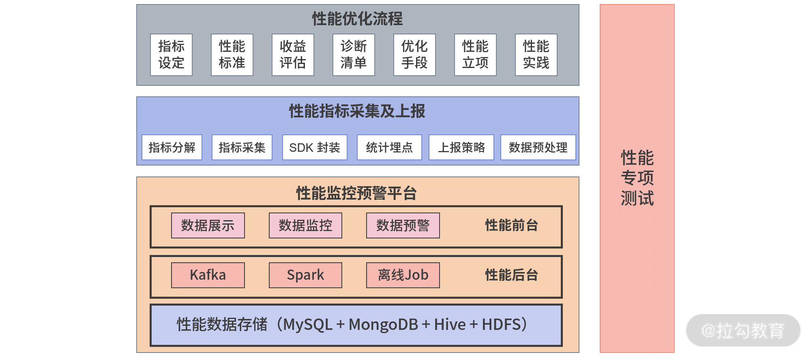
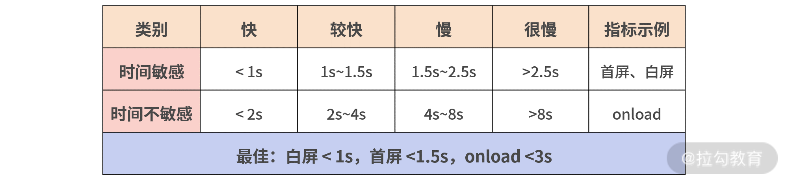
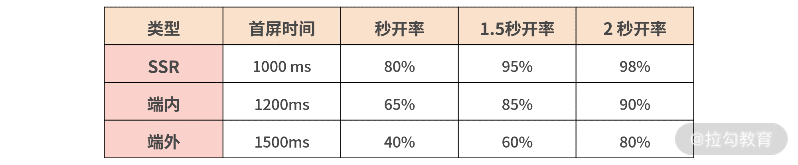

# 体系总览：性能优化体系及关键指标设定

## 性能优化体系概览

这个性能优化体系具体有哪些内容呢？它主要包括三部分：性能优化流程、性能指标采集及上报、性能监控预警平台。

## 第一部分，性能优化流程

+ 性能指标设定: 说的是我们要选择什么样的指标。比如页面打开慢，我们想要优化它，该从哪些地方入手，优化完后怎么知道问题解决了？这些就需要明确的指标来衡量
+ 性能标准确定: 也就是我们性能优化目标是怎样的，优化到什么程度合适。例如，我们要优化 App 里面的 H5 页面打开速度，确定的指标是秒开率，那一秒内可以打开的请求比例就是它的性能标准。
+ 收益评估: 比如，列表页到详情页的转化率能不能提升？用户跳出率可不可降低？
+ 诊断清单: 把业务代码接入性能监控预警平台，根据性能标准给出诊断清单
+ 优化手段: 根据性能标准和诊断清单确定具体的优化手段
+ 性能立项: 落地实践
+ 性能实践: 即经过优化之后发起项目上线，并跟踪进行效果评估，结合场景把这些项目成果以文档或代码的形式沉淀下来，给后来者使用参考

## 第二部分，性能指标采集与上报

它的主要内容是把前面提到的性能指标以代码的形式分解落地，确保可以采集，然后在 SDK 封装后集合统计埋点，最后根据实际情况，制定上报策略

我们还需要注意将一些“脏数据”（也就是明显异常的数据）丢弃掉，避免占用用户网络带宽。

## 性能监控预警平台

主要是通过分析上一步采集到的性能数据，再对比性能标准进行监控。当指标超过某一监控阈值时，性能监控预警平台会通过邮件或者短信，给我们发送预警信息。

性能监控预警平台包括：性能数据处理后台和性能可视化展现前台两部分。

其中，性能数据处理后台，主要是在性能采集数据上报到性能平台后，对数据进行预处理、数据清洗和数据计算，然后生成前台可视化所需数据。

性能可视化展现前台包括性能展示、性能监控预警，主要是对核心数据指标进行可视化展现，对性能数据波动进行监控，对超出阈值的数据给出短信或邮件报警。

为了确保没问题，在上线前一定要做性能专项测试，检查一下你采取的措施和性能优化预期是否一致。

## 如何设定性能关键指标？

一个是关注什么样的指标，一个是关键指标的设定及标准。

## 什么样的指标值得我们关注？

要确定关键的性能指标，必须满足两点：

+ 可衡量，就是可以通过代码来度量；

+ 关注以用户为中心的关键结果和真实体验。

基于这两点，在性能指标方面，选定加载、交互性和视觉稳定性这三个方向，了解性能指标及其标准设定。

## 性能优化关键指标设定及标准

+ 加载: 就是进入页面时，页面内容的载入过程。特别是白屏时间和首屏时间,除了手动采集之外，还可以自动化采集
+ 交互: 就是用户点击网站或 App 的某个功能，页面给出的回应,手动采集
+ 视觉稳定性指标: CLS,布局偏移量,它是指页面从一帧切换到另外一帧时，视线中不稳定元素的偏移情况, 手动采集

### 加载关键指标 - 白屏时间和首屏时间的设定及其标准

什么叫白屏时间呢？它指的是从输入内容回车（包括刷新、跳转等方式）后，到页面开始出现第一个字符的时间。这个过程包括 DNS 查询，建立 TCP 连接，发送首个HTTP请求（如果使用HTTPS还要介入 TLS 的验证时间），返回HTML文档，HTML文档 Head 解析完毕。它的标准时间是 300ms。

如果白屏时间过长，用户会认为我们的页面不可用，或者可用性差。如果超过一定时间（如 1s），用户注意力就会转移到其他页面。

哪些因素会导致白屏时间过长？原因有很多，有可能是 DNS 查询时间长，建立 TCP 请求链接太慢，或者是服务器处理请求速度太慢，客户端下载、解析、渲染时长过长，没有做 Gzip 压缩，缺乏本地离线化处理，等等。

接下来我们看首屏时间，它是怎么计算的？

**首屏时间=白屏时间+渲染时间**。它是指从浏览器输入地址并回车后，到首屏内容渲染完毕的时间。这期间不需要滚动鼠标或者下拉页面，否则无效。

在加载性能指标方面，相比于白屏时间，首屏时间更重要。为什么？

+ 从重要性角度看，打开页面后，第一眼看到的内容一般都非常关键，比如电商的头图、商品价格、购买按钮等。这些内容即便在最恶劣的网络环境下，我们也要确保用户能看得到。

+ 从体验完整性角度看，进入页面后先是白屏，随着第一个字符加载，到首屏内容显示结束，我们才会认为加载完毕，用户可以使用了。

首屏时间的标准，最初只是根据这个页面对时间是否敏感来判定，主要以用户平均首屏加载时间来计算，并没有详细区分 2G/3G/4G/WiFi 这些网络环境。

便于理解，我们引入了秒开率的指标，即 1s 内打开用户的占比。这个概念最早来自阿里巴巴，后来被业界普遍采用。

**问题：在交互和视觉稳定性两个方向，这个指标怎么设定和计算的吗？**

First Input Delay (FID): 衡量可交互性，为了提供良好的用户体验，页面的">FID应当小于 100毫秒。
Cumulative Layout Shift (CLS): 衡量视觉稳定性，为了提供良好的用户体验，页面的CLS应保持小于 0.1。