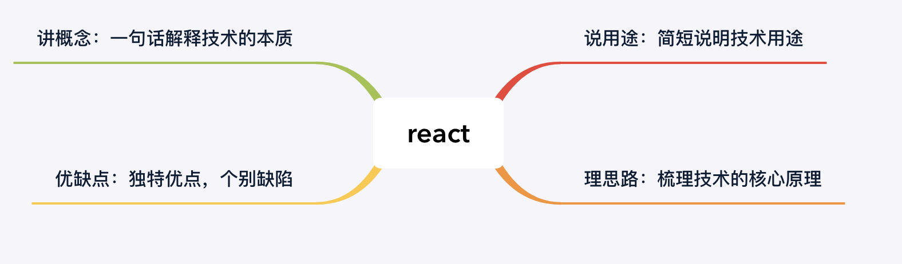

# 了解react

## 如何解释 React 是什么？/ 谈一谈你对 React 的理解？

对待这类概念题，讲究一个四字口诀“讲说理列”，即“讲概念，说用途，理思路，优缺点，列一遍” 

1. 讲原理：用简洁的话说明这个技术是做什么用的，最好一句话概括
2. 说用途：描述该技术的用途，能够具体结合适合场景，拓展性的描述
3. 理思路：梳理该技术的核心思路和运作过程，这个地方可深可浅，如果对其有足够深入的了解，建议详细地展开说明。
4. 优缺点，列一遍：对该技术栈的优缺点进行列举。列举优缺点肯定有与其他技术方案横向对比的过程，那么在这个过程中，切忌刻意地踩一捧

面试回答如下：

1. react是用于构建用户界面的javascript库，通过组件化的方式解决视图层开发复用的问题，本质是一个组件化的框架
2. 它的核心设计思路是声明式、组件化与一次学习，随处编写，react声明式的优势在于可以使应用的每一个状态设计简洁的视图，当数据改变时 React 能有效地更新并正确地渲染组件，组件化的优势在于视图的拆分与模块复用，可以更容易做到高内聚低耦合，并且一次学习，随处编写使得它更加的通用，并且react具有丰富的社区资源，无论是PC端、移动端网页、开发 iOS 与 Android 应用都可以很好的适用。react作为视图层的框架，在开发大型前端应用时，需要向社区寻找并整合解决方案，开发者在技术选型和学习适用上具有较高的学习成本
3. 个人对于react优化的看法？
4. 谈一谈 React 相关的工程架构与设计模式？

## 框架之间的对比

1. jquery.js: 为了解决浏览器的兼容性问题，jQuery 封装 DOM 操作，提供样式选择器，封装了 AJAX、链式操作等大量基础函数，使用起来很方便，但是jQuery 并没有解决代码如何组织的问题，本质上它只是一个工具函数合集。
2. AngularJS：提供了一揽子全家桶解决方案，从底层开始深度封装，向上提供了路由、双向绑定、指令、组件等框架特性，解决了如何组织代码结构，如何有效提升复用率的问题，但是学习成本相当的大
3. react
4. vue
   