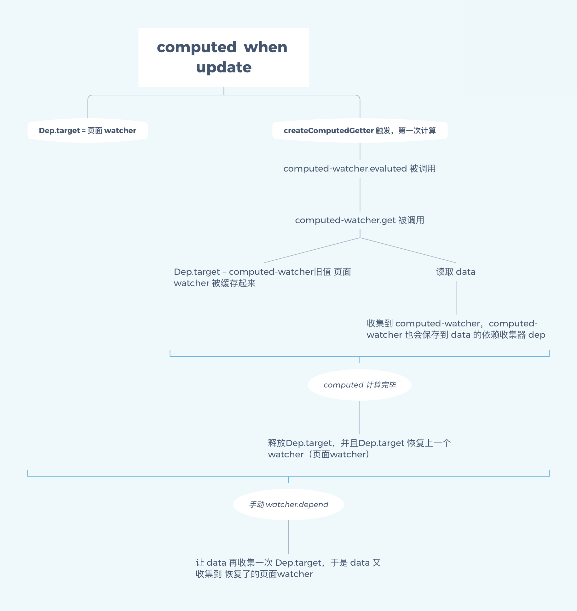
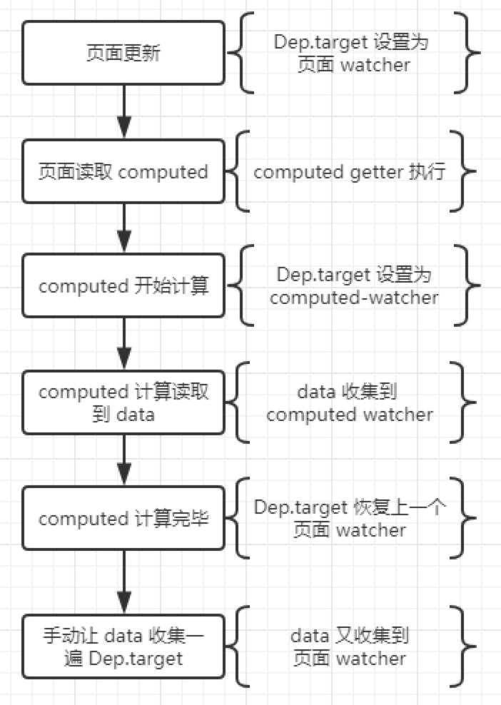
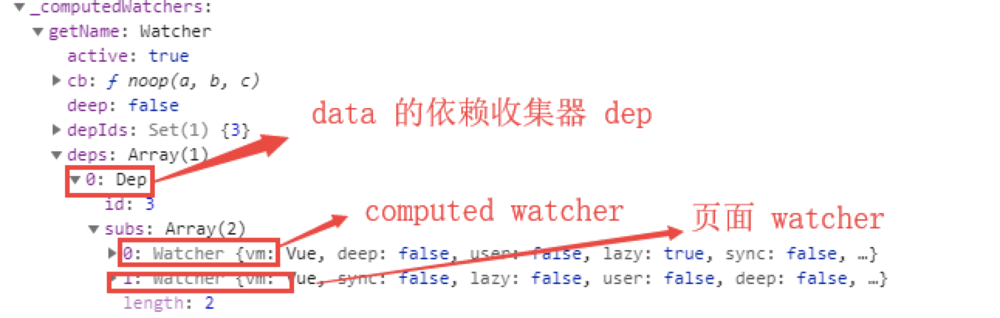

# Vue原理之Computed

<a data-fancybox title="执行上下文的类型" href="/initComputed.png"></a>

## computed 什么时候初始化

```js
function Vue(){
  ... 其他处理
  initState(this)
  ...解析模板，生成DOM 插入页面
}

const computedWatcherOptions = { lazy: true }

function initComputed (vm: Component, computed: Object) {
  const watchers = vm._computedWatchers = Object.create(null)
  const isSSR = isServerRendering()

  for (const key in computed) {
    const userDef = computed[key]
    const getter = typeof userDef === 'function' ? userDef : userDef.get
    ...

    if (!isSSR) {
      watchers[key] = new Watcher(vm, getter || noop, noop, computedWatcherOptions)
    }
    if (!(key in vm)) {
      defineComputed(vm, key, userDef)
    } else if (process.env.NODE_ENV !== 'production') {
      ...
    }
  }
}
```

从上述代码中可以看出来，在`vue`创建实例的时候会初始化各种选项，其中initState方法中会初始化`props、methods、data、computed、以及watch`，其中`initComputed`就是初始化`computed`。在`initComputed`方法中主要做了三件事儿：

1. 为每一个`computed`属性分配一个`watcher`
2. 组件定义的计算属性已经在组件原型（重名）此处通过`defineComputed`将属性实例化。
3. 收集所有 `computed` 的 `watcher`

## 一、每个 computed 配发 watcher
 
首先来看一下 `Watcher` 源码构造函数和`computed`调用`watcher`的方法

```js
var Watcher = function Watcher (
  vm, // 相对于computed的vue实例对象
  expOrFn, // 相对于computed的getter收集方法
  cb,
  options, // 相对于computed来说的选项值
  isRenderWatcher
) {  
  // 此处options = { lazy: true }
  if (options) {
    this.deep = !!options.deep;
    this.user = !!options.user;
    this.lazy = !!options.lazy;
    this.sync = !!options.sync;
    this.before = options.before;
  } else {
    this.deep = this.user = this.lazy = this.sync = false;
  }
  // 步骤一：新建 watcher 的时候，传入 lazy：true
  this.dirty = this.lazy; // for lazy watchers
  // 步骤二：保存设置的 getter
  if (typeof expOrFn === 'function') {
    this.getter = expOrFn;
  }
  // 步骤三：watcher.value 存放计算结果
  this.value = this.lazy ? undefined : this.get();
}

watchers[key] = new Watcher(vm, getter || noop, noop, computedWatcherOptions)
```

从以上代码可以看出来，`computed` 和 `watcher` 之间的关系如下：

1. `computed` 新建 `watcher` 的时候，传入 `lazy`

作用是把计算结果缓存起来，而不是每次使用都要重新计算

`lazy` 表示一种固定描述，不可改变，表示这个 `watcher` 需要缓存

而 `watcher`内部的 `dirty` 表示缓存是否可用，如果为 `true`，表示缓存脏了，需要重新计算，否则不用

`dirty` 默认是 `false` 的，而 `lazy` 赋值给 `dirty`，就是给一个初始值，表示 你控制缓存的任务开始了

**【dirty】是真正的控制缓存的关键**

2. 保存设置的 `getter`

把用户设置的 `computed-getter`，存放到 `watcher.getter` 中，用于后面的计算

3. `watcher.value` 存放计算结果，但是这里有个条件，因为 `lazy` 的原因，不会新建实例并马上读取值

这里可以算是 `Vue` 的一个优化，只有你再读取 `computed`，再开始计算，而不是`初始化`就开始计算值了

虽然没有一开始计算，但是计算 `value` 还是这个 `watcher.get` 这个方法，来看下源码

```js
Watcher.prototype.get = function get () {
  pushTarget(this); // 此处进行收集依赖
  var value;
  var vm = this.vm;
  try {
    value = this.getter.call(vm, vm);
  } catch (e) {
    ...
  } finally {
    ...
  }
  return value
};
```

这个方法，其实就是执行 保存的 `getter` 函数，从而得到计算值`value`, 并保存在`watcher.value`当中

## 二、computed 的缓存是怎么做的（defineComputed方法）

```js
function defineComputed (
  target: any, // vm
  key: string, // key
  userDef: Object | Function // computed[key]
) {
  const shouldCache = !isServerRendering()
  if (typeof userDef === 'function') {
    sharedPropertyDefinition.get = shouldCache
      ? createComputedGetter(key)
      : createGetterInvoker(userDef)
    sharedPropertyDefinition.set = noop
  } else {
    sharedPropertyDefinition.get = userDef.get
      ? shouldCache && userDef.cache !== false
        ? createComputedGetter(key)
        : createGetterInvoker(userDef.get)
      : noop
    sharedPropertyDefinition.set = userDef.set || noop
  }
  // 重点在此处：将computed的属性值直接定义在vm实例对象上
  Object.defineProperty(target, key, sharedPropertyDefinition)
}

defineComputed(vm, key, userDef)
```

从以上代码可以看出来

1. 使用 `Object.defineProperty` 在 实例上`computed` 属性，所以可以直接访问
2. `createComputedGetter`返回`get`函数

接下来看一下`createComputedGetter`的源码

```js
function createComputedGetter (key) { // 拿到当前computed监听的key
  return function computedGetter () {
    // 判断computed的key是否分配了watcher
    const watcher = this._computedWatchers && this._computedWatchers[key]
    if (watcher) {
      // 如果 computed 依赖的数据变化，dirty 会变成true，从而重新计算，然后更新缓存值 watcher.value
      if (watcher.dirty) {
        watcher.evaluate() // 需要缓存执行watcher.evaluate()
      }
      // 这里是 月老computed 牵线的重点，让双方建立关系
      if (Dep.target) {
        watcher.depend()
      }
      return watcher.value
    }
  }
}

Watcher.prototype.evaluate = function evaluate () {
  this.value = this.get();
  this.dirty = false;
};
```

从上述代码中可以看出来，`computed` 的缓存主要由`watcher.dirty`控制，为`true`的时候`watcher.evaluate()`用来重新计算，更新缓存值`watcher.value`，并重置 `dirty = false`，表示`缓存已更新`。

**通过 控制 `dirty` 从而控制缓存，但是怎么控制`dirty` 呢？**

如果computed的数据`A`调用了data的数据`B`，即`A依赖B`，那么就会`B`会收集到`A`的`watcher`，当`B`发生改变了，就会通知`A`进行更新，即调用 `A-watcher.update`，当通知 `computed` 更新的时候，就只是把 `dirty` 设置为 `true`，从而读取 `comptued` 时，便会调用 `evalute` 重新计算。

```js
Watcher.prototype.update = function update () {
  /* istanbul ignore else */
  if (this.lazy) {
    this.dirty = true;
  } else if (this.sync) {
    this.run();
  } else {
    queueWatcher(this);
  }
}
```

**computed的月老牵线**

现有 页面-P，computed- C，data- D

```js
1、P 引用了 C，C 引用了 D
2、理论上 D 改变时， C 就会改变，C 则通知 P 更新。
3、实际上 C 让 D 和 P 建立联系，让 D 改变时直接通知 P
```

实现上述问题主要在于以下代码

```js
if (Dep.target) {
  wather.depend()
}

// 遍历订阅收集依赖
Watcher.prototype.depend = function depend () {
  var i = this.deps.length;
  while (i--) {
    this.deps[i].depend();
  }
};
```

上述代码的意思主要是让 `D` 的依赖收集器收集到 `Dep.target`，而 `Dep.target`就是页面`P`的`watcher`，所以这里，`D`就会收集到页面的 `watcher` 了，所以就会直接通知页面 `watcher`

**为什么 Dep.target 是 页面 watcher？**

```js
Watcher.prototype.get = function get () {
  // 改变 Dep.target
  pushTarget(this);
  var value;
  var vm = this.vm;
  try {
    // getter 就是 watcher 回调
    value = this.getter.call(vm, vm);
  } catch (e) {
    ...
  } finally {
    // "touch" every property so they are all tracked as
    // dependencies for deep watching
    if (this.deep) {
      traverse(value);
    }
    popTarget();
    this.cleanupDeps();
  }
  return value
};

function pushTarget (target) {
  // 把上一个 Dep.target 缓存起来，便于后面恢复
  targetStack.push(target);
  Dep.target = target;
}
```

综上所述，月老牵线的详细过程如下：

1. 页面更新，读取 computed 的时候，Dep.target 会设置为 页面 watcher。

2. computed 被读取，createComputedGetter 包装的函数触发，第一次会进行计算

3. computed-watcher.evaluted 被调用，进而 computed-watcher.get 被调用，Dep.target 被设置为 computed-watcher，旧值 页面 watcher 被缓存起来。

computed 计算会读取 data，此时 data 就收集到 computed-watcher

同时 computed-watcher 也会保存到 data 的依赖收集器 dep（用于下一步）。

computed 计算完毕，释放Dep.target，并且Dep.target 恢复上一个watcher（页面watcher）

4. 手动 watcher.depend， 让 data 再收集一次 Dep.target，于是 data 又收集到 恢复了的页面watcher



**再额外记一个data改变后续流程**

综上，此时 data 的依赖收集器=【computed-watcher，页面watcher】

data 改变，正序遍历通知，computed 先更新，页面再更新，所以，页面才能读取到最新的 computed 值





## 三、收集所有 `computed` 的 `watcher`

从源码中，你可以看出为每个`computed` 新建`watcher` 之后，会全部收集到一个`对象`中，并挂到实例上.为了在 `createComputedGetter`使用`key`去找到对应的 `watcher`