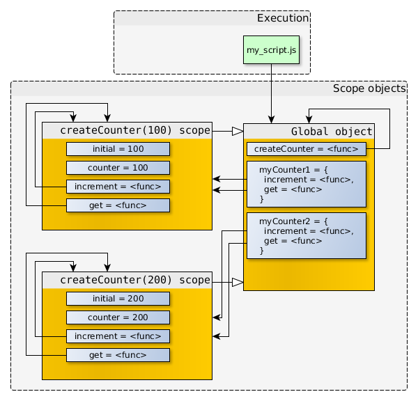

# 闭包

## 一、什么是闭包

在 JavaScript 中，根据词法作用域的规则，内部函数总是可以访问其外部函数中声明的变量。

当通过调用一个外部函数返回一个内部函数后，即使该外部函数已经执行结束了，但是内部函数引用外部函数的变量依然保存在内存中，闭包是一种特殊的对象，它有两部分构成，一部分是函数，另外一部分是创造该函数的环境。环境由闭包创建时作用域中任何局部变量所组成

简单来说：

在函数 A 中还有函数 B，函数 B 调用了函数 A 中的变量，那么函数 B 就称为函数 A 的闭包。

## 二、怎样产生一个闭包

创建闭包最常见的方式就是在一个函数内部定义另一个函数

```js
"use strict";
function createCounter(initial) {
  var counter = initial;
  
  function increment(value) {
    counter += value;
  }
  
  function get() {
    return counter;
  }
  
  return {
    increment: increment,
    get: get
  };
}

var myCounter = createCounter(100);
console.log(myCounter.get());   // 返回 100

myCounter.increment(5);
console.log(myCounter.get());   // 返回 105
```

**闭包的作用域链包含了自身作用域，被定义所在函数作用域以及全局作用域**

## 闭包的注意事项

1. 通常函数的作用域及其所有变量在函数执行结束之后就会被销毁，但是闭包在创建了之后，这个函数作用域就会一直存在等闭包不存在了之后才会被销毁

通常情况下当函数返回没有被引用的时候，就会被垃圾回收器回收。即使两个相互引用的对象而不被第三个对象所引用，那么这两个相互引用的对象也会被回收。

但是对于闭包，即使外部函数返回了，函数对象仍会引用它被创建时的作用域对象。


单独调用increment(5)时，参数value保存在当前的作用域对象。当函数要访问counter时，没有找到，于是沿着作用域链向上查找，在createCounter(100)的作用域找到了对应的标示符，increment()就会修改counter的值。除此之外，没有其他方式来修改这个变量。闭包的强大也在于此，能够**存贮私有数据**。


定义两个函数

```js
var myCounter1 = createCounter(100);
var myCounter2 = createCounter(200);
```
关系图如下： 



myCounter1.increment和myCounter2.increment的函数对象拥有着一样的代码以及一样的属性值（name，length等等），但是它们的[[scope]]指向的是不一样的作用域对象。

1. 闭包只能取回包含函数中任何变量的最后一个值，这是因为闭包保存的是整个变量对象，而不是某个特殊变量

```js
function test() {
  var arr = []
  for (var i = 0; i < 10; i++) {
    arr[i] = function () { return i }
  }
  for (var a = 0; a < arr.length; a++) {
   console.log('arr', arr[a]())
  }
}
test() // 10个10
```

对于以上的输出并不是我们想要的，那需要我们改动一下上面的代码

```js
function test() {
  var arr = []
  for (let i = 0; i < 10; i++) {
    arr[i] = function () { return i }
  }
  for (var a = 0; a < arr.length; a++) {
   console.log('arr', arr[a]())
  }
}
test() // 0-10
```

**上述问题的原因引出一个经典的面试问题**

js闭包是如何处理父函数中let形成块级作用域中定义的变量的

> 解答：区别在于每次for循环里面都是一个单独的块极作用域，而let就是块极作用域里面声明变量，可以理解为每次执行for的时候都是一个新的i，所以在for循环的块中找，自然i不一样，可以理解为每次循环都保存了一个变量i，这个i属于对应的那次执行的块极作用域，而var是函数作用域，for循环无论执行多少次，都是去最近的堆栈里面找，而不是块中找，所以只有一个i，现在的i是10

3. 闭包中的this对象


```js
var name = 'liqian'

var obj = { 
  name: 'zhansan',
  getName: function () {
    return function () {
      return this.name
    }
   }
 }
 obj.getName()() // liqian

```

执行obj.getName()()实际上执行的是匿名函数，匿名函数的作用域指向了全局window，**匿名函数的执行函数具有全局性 **

## 三、闭包的应用

1. 定义函数的私有变量和函数

```js
function Person () {
    var _name = 'xiaowa'
    return {
        getName: function () {
            return _name
        }
    }
}

const person = new Person()

console.log(person._name) // undefined

console.log(person.getName()) // xiaowa
```
   
2. 可以做计数器

## 四、闭包的优缺点

**优点**

1. 缓存。将变量隐藏起来不被 GC 回收
   
2. 实现柯里化。利用闭包特性完成柯里化。

**缺点**

1. 内存消耗。闭包产生的变量无法被销毁。

2. 性能问题。由于闭包内部变量优先级高于外部变量，所以需要多查找作用域链的一个层次，一定程度影响查找速度。

## 五、柯里化

柯里化（Currying）是把接受多个参数的函数转变为单一参数的函数，并且返回接受余下的参数且返回结果的新函数的技术。

**简单来说：**

+ 通过闭包管理
+ 支持链式调用
+ 每次运行返回一个 function

即：通过将多个参数换成一个参数，每次运行返回新函数的技术

### 1. 柯里化好处

+ 参数复用

+ 提前确认

+ 延迟运行

### 2. 实现 add(1)(2)(3)

```js
// 实现一个 add 方法，使计算结果能够满足以下预期
add(1)(2)(3) = 6;
add(1, 2, 3)(4) = 10;
add(1)(2)(3)(4)(5) = 15;
```

```js
function add () {
  const numberList = Array.from(arguments);
  
  // 进一步收集剩余参数
  const calculate = function() {
    numberList.push(...arguments);
    return calculate;
  }

  // 利用 toString 隐式转换，最后执行时进行转换
  calculate.toString = function() {
    return numberList.reduce((a, b) => a + b, 0);
  }

  return calculate;
}

// 实现一个 add 方法，使计算结果能够满足以下预期
console.log(add(1)(2)(3)); // 6
console.log(add(1, 2, 3)(4)); // 10;
console.log(add(1)(2)(3)(4)(5)); // 15;
```

### 3. 题目：实现compose(foo, bar, baz)('start')

```js
function foo(...args) {
  console.log(args[0]);
  return 'foo';
}
function bar(...args) {
  console.log(args[0]);
  return 'bar';
}
function baz(...args) {
  console.log(args[0]);
  return 'baz';
}

function compose() {
  // 闭包元素 - 函数列表
  const list = Array.from(arguments);

  // 闭包元素 - 函数列表执行位置
  let index = -1;

  // 闭包元素 - 上一个函数的返回
  let prev = '';

  // 返回闭包函数
  const doNext = function() {
    index++; // 索引值累加
    // 一开始没有上一个元素时，获取第二个括号的值
    if (!prev) {
      prev = arguments[0];
    }
    // 设置前一个结果为当前函数返回
    prev = list[index](prev);
    // 递归调用
    if (index < list.length - 1) {
      doNext(index + 1);
    }
  };

  // 第一次返回闭包函数
  return doNext;
}

compose(foo, bar, baz)('start');
```

## 六、闭包相关的面试题

1. 输出下面的结果

```js
function fun(n, o) {
  console.log(o)
  return {
    fun: function (m) {
      return fun(m, n)
    }
  }

}
var a = fun(0) // undefiend
a.fun(1) // 0
a.fun(2) // 0
a.fun(3) // 0
var b = fun(0).fun(1).fun(2).fun(3) // undefiend 0 1 2
var c = fun(0).fun(1) // undefiend 0
c.fun(2) // 1
c.fun(3) // 1

```

2. 输出结果

```js
function test() {
  var n = 4399;

  function add() {
    n++;
    console.log(n);
  }

  return {
    n,
    add
  };
};

var result = test();
var result2 = test();

result.add(); // 输出啥
result.add(); // 输出啥

console.log(result.n); // 输出啥

result2.add(); // 输出啥

// 4400 4401 4399 4400
```

3. 输出结果
  
```js
function Foo() {
  var i = 0;
  return function() {
    console.log(i++);
  }
}

var f1 = Foo();
var f2 = Foo();

f1();
f1();
f2();

// 0 1 0
```