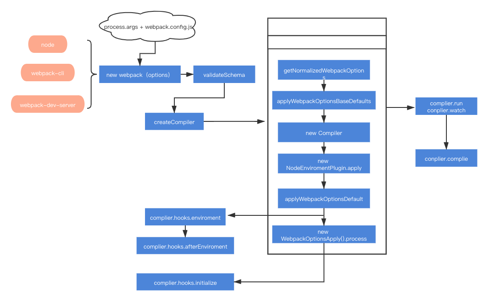

# webpack框架体系理解分析

时至 5.0 版本之后，webpack功能集已经非常的强大了，包括模块打包、代码分割、按需加在、HMR、tree-shaking、文件监听，sourceMap、Module Federation、devServer、DLL、多进程等等，所以将webpack这个庞大的体系分为三个部分

+ 1. 核心构建流程
+ 2. loader的作用
+ 3. plugin 架构与常用套路

三者协作构成 webpack 的主体框架：

## 一、核心流程解析

**webpack最核心的功能**就是将各种类型的资源，包括图片、css、js等，经过转译、组合、拼接生成js类型的bundle文件

这个过程的核心完成了 **内容转换 + 资源合并** 两种功能，实现上包括了三个阶段

1. 初始化阶段
   1. 初始化参数：从配置文件、 配置对象、Shell 参数中读取，与默认配置结合得出最终的参数
   2. 创建编译器对象：包括注入内部插件、注册各个模块的工厂、初始化RuleSet集合、加载配置的参数
   3. 开始编译：执行**compiler**的**run**方法
   4. 确定入口：根据配置过程中的**entry**找到所有的入口文件，调用**compilition.addEntry**将入口文件转换成**dependence**对象
   > 1. compiler: 编译管理器，webpack 启动后会创建 compiler 对象，该对象一直存活知道结束退出
   > 2. Compilation：单次编辑过程的管理器，比如 watch = true 时，运行过程中只有一个 compiler 但每次文件变更触发重新编译时，都会创建一个新的 compilation 对象
   > 3. Dependence：依赖对象，webpack 基于该类型记录模块间依赖关系
2. 构建阶段
   1. 编译模块make：根据**entry**对应的的**dependence**创建**moudle**对象，调用**loader**将模块转译成标准的js内容，在调用js解释器将内容转换成AST对象，从中找出该模块依赖的模块，在递归这个步骤，直到所有的入口文件依赖的文件都经过了这一步的处理
   2. 完成模块编译：上一步递归处理所有能触达到的模块后，得到了每一个模块被翻译之后的内容和他们的**关系依赖图**
   > 1. Module：webpack 内部所有资源都会以“module”对象形式存在，所有关于资源的操作、转译、合并都是以 “module” 为基本单位进行的
3. 生成阶段
   1. 输出资源（seal）：根据入口和模块之间的依赖关系，组装成一个个包含多个模块的**Chunk**，再把每一个Chunk转换成单个的文件放在输出列表里，**这步是可以改变输出文件的最后的阶段**
   2. 写入文件系统（emitAssets）：在确定好输出内容之后，根据配置里面的输出路径和文件名，把文件内容写入到文件系统

### 1. 初始化流程阶段

1. 将process.args + webpack.config.js 中的参数进行合并
2. 调用vaidateSchema的方法进行校验
3. 调用 getNormalizedWebpackOptions + applyWebpackOptionsBaseDefaults 合并出最终配置
4. 创建 compiler 对象
5. 遍历用户定义的plugins集合，执行对应的apply方法
6. 调用new WebpackOptionsApply().process 方法，加载各种内置插件
   
   主要逻辑集中在**WebpackOptionsApply**类中，webpack具有很多内置的插件，这些插件不需要我们手动配置，WebpackOptionsApply会在初始化过程中根据配置内容动态注入对应的插件，包括：

   + 注入 EntryOptionPlugin 插件，处理 entry 配置
   + 根据 devtool 值判断后续用那个插件处理 sourcemap，可选值：EvalSourceMapDevToolPlugin、SourceMapDevToolPlugin、EvalDevToolModulePlugi
   + 注入 RuntimePlugin ，用于根据代码内容动态注入 webpack 运行时

到这里，compiler 实例就被创建出来了，相应的环境参数也预设好了，紧接着开始调用 compiler.compile 函数：

