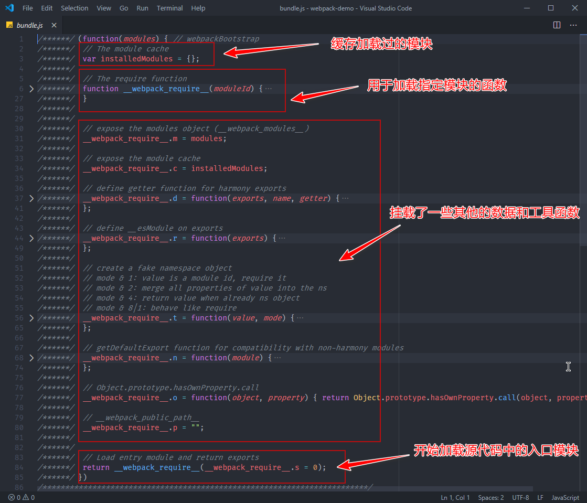

# 如何使用 Webpack 实现模块化打包？

## 一、webpack是什么？介绍一下webpack？

webpack作为JavaScript应用程序的静态模块打包器，当 webpack 处理应用程序时，它会递归地构建一个依赖关系图，其中包含应用程序需要的每个模块，然后将所有这些模块打包成一个或多个 bundle，主要解决以下问题：

1. 将零散的 JavaScript 代码打包到一个 JS 文件中，解决模块化的打包问题
2. 对于有环境兼容问题的代码，webpack可以在打包过程中通过loader机制对其实现编译转换，然后再进行打包
3. 对于不同类型的前端模块， webpack支持javascript中以模块化的方式载入任意类型的资源文件
4. webpack还具有代码拆分的能力，它能够将应用中所有的模块按照我们的需要进行打包，避免产生单个文件过大，加载过慢，实现渐进式加载。

## 二、通过 Webpack 打包后的结果是如何运行起来的

我们通过观察`boundle.js`文件可以看出来，打包过后的文件本质上就是一个立即执行函数，函数本身接收一个 `modules` 参数，调用时传入了一个`数组`，这个数组，里面的元素均是参数列表相同的函数。这里的函数对应的就是我们`源代码中的模块`，也就是说每个模块最终被包裹到了这样一个函数中，从而实现`模块私有作用域`。



在这个`boundle.js`当中的自执行函数的最后调用了require 函数，并传入了模块 id 为 0，开始加载模块即入口文件。

## 三、loader机制

Loader 就是负责完成项目中各种各样资源模块的加载，从而实现整体项目的模块化

### 各个loader的作用

1. css-loader

只会把css模块转换成一个js模块，具体的实现方法是将css代码放在一个数组当中，这个数组是由 css-loader 内部的一个模块提供的，但是整个过程并没有任何地方使用到了这个数组。即 **css-loader 只会把 CSS 模块加载到 JS 代码中，而并不会使用这个模块**。

2. style-loader

将 css-loader 中所加载到的所有样式模块，通过创建 style 标签的方式添加到页面上

### loader的处理时机

Webpack 在打包过程中会循环遍历每个模块，然后根据配置将每个遇到的模块交给对应的 Loader 去处理，最后再将处理完的结果打包到一起。

### 为什么要在 JS 中加载其他资源

1. 一来逻辑上比较合理，因为 JS 确实需要这些资源文件配合才能实现整体功能；

2. 二来配合 Webpack 这类工具的打包，能确保在上线时，资源不会缺失，而且都是必要的

## 四、如何利用插件机制横向扩展 Webpack 的构建能力？

Plugin是用来解决项目中除了资源模块打包以外的其他自动化工作

### 1、常见的应用场景

1. 实现自动在打包之前清除 dist 目录（上次的打包结果）- `clean-webpack-plugin`
2. 自动生成应用所需要的 HTML 文件 - `html-webpack-plugin`
3. 根据不同环境为代码注入类似 API 地址这种可能变化的部分；
4. 拷贝不需要参与打包的资源文件到输出目录 - `copy-webpack-plugin`；
5. 压缩 Webpack 打包完成后输出的文件；
6. 自动发布打包结果到服务器实现自动部署

### 2、常见的插件

1. 实现自动在打包之前清除 dist 目录（上次的打包结果）- `clean-webpack-plugin`

```js
  const { CleanWebpackPlugin } = require('clean-webpack-plugin')

  module.exports = {
    plugins: [
        new CleanWebpackPlugin()
    ]
  }
```

2. 自动生成应用所需要的 HTML 文件 - `html-webpack-plugin`

优点：

+ HTML 也输出到 dist 目录中了，上线时我们只需要把 dist 目录发布出去就可以了
+ HTML 中的 script 标签是自动引入的，所以可以确保资源文件的路径是正常的
+ 如果需要创建多个页面，就需要在插件列表中加入多个 HtmlWebpackPlugin 的实例对象，让每个对象负责一个页面文件的生成

3. 用于复制文件的插件 - `copy-webpack-plugin`

```js
  const { CleanWebpackPlugin } = require('copy-webpack-plugin')

  module.exports = {
    plugins: [
        new CleanWebpackPlugin({
            patterns: ['public']
        })
    ]
  }
```

4. webpack注入全局变量的插件 - `webpack.DefinePlugin`

```js
const webpack = require('webpack')
module.exports = {
  plugins: [
    new webpack.DefinePlugin({
      API_BASE_URL: '"https://api.example.com"'
    })
  ]
}
```

5. webpack配置代码的合并 - `webapck-merge`

```js
const merge = require('webpack-merge')
const common = require('./webpack.common')
module.exports = merge(common, {
  // 开发模式配置
})
```

6. 将 CSS 代码从打包结果中提取出来 - `mini-css-extract-plugin`

由于要捕获到所有的样式，我们需要将style-loader替换成MiniCssExtractPlugin.loader

区别于style-loader，style-loader是将css代码以style的形式插入到代码当中，而`mini-css-extract-plugin`的loader是将css代码抽离出来直接通过 link 标签引入页面

> 如果你的 CSS 体积不是很大的话，提取到单个文件中，效果可能适得其反，因为单独的文件就需要单独请求一次。个人经验是如果 CSS 超过 200KB 才需要考虑是否提取出来，作为单独的文件。

```js
const MiniCssExtractPlugin = require('mini-css-extract-plugin')
module.exports = {
  module: {
    rules: [
      {
        test: /\.css|less$/,
        use: [
          MiniCssExtractPlugin.loader,
          'css-loader',
          'less-loader',
        ]
      }
    ]
  },
  plugins: [
    new MiniCssExtractPlugin()
  ]
}
```

7. 压缩单独提取出来的css代码 - `optimize-css-assets-webpack-plugin`

Webpack 内置的压缩插件仅仅是针对 JS 文件的压缩，其他资源文件的压缩都需要额外的插件。

此插件基于`mini-css-extract-plugin`进行使用

```js
const MiniCssExtractPlugin = require('mini-css-extract-plugin')
const OptimizeCssAssetsWebpackPlugin = require('optimize-css-assets-webpack-plugin')
module.exports = {
  module: {
    rules: [
      {
        test: /\.css|less$/,
        use: [
          MiniCssExtractPlugin.loader,
          'css-loader',
          'less-loader',
        ]
      }
    ]
  },
  // OptimizeCssAssetsWebpackPlugin两种配置方式
  plugins: [
    new MiniCssExtractPlugin(),
    // new OptimizeCssAssetsWebpackPlugin() 配置在此处则是这个插件在任何情况下都会工作
  ],
  optimization: {
    minimizer: [ // webpack 压缩插件统一交与minizmier统一进行控制
      new OptimizeCssAssetsWebpackPlugin()
      // 只会在 minimize 特性开启时才工作
    ]
  }
}
```

**注意： 配置在minimizer内部的OptimizeCssAssetsWebpackPlugin虽然可以正常压缩css代码，但是webpack内置对于js代码的压缩处理却失效了，原因在于，webpack会认为你配置了minimizer是要采用自定义的压缩方式，所以内置的压缩方式就会失效**

8. 压缩js代码 - `terser-webpack-plugin`
```js
const OptimizeCssAssetsWebpackPlugin = require('optimize-css-assets-webpack-plugin')
const TerserWepackPlugin = require('terser-webpack-plugin')

module.exports = {
  optimization: {
    minimizer: [
      new OptimizeCssAssetsWebpackPlugin(),
      new TerserWepackPlugin()
    ]
  }
}
```


### 3、手动实现一个plugin的步骤

1. Webpack 要求我们的插件必须是一个函数或者是一个包含 apply 方法的对象，一般我们都会定义一个类型，在这个类型中定义 apply 方法，然后在使用时，再通过这个类型来创建一个实例对象去使用这个插件;
   
```js
class RemoveCommentsPlugin {
    apply() {}
}
```

2. apply方法会在 Webpack 启动时被调用，它接收一个 compiler 对象参数，这个对象是 Webpack 工作过程中最核心的对象，里面包含了我们此次构建的所有配置信息;

```js
class RemoveCommentsPlugin {
    apply(compiler) {}
}
```

3. 明确我们这个任务的执行时机，也就是到底应该把这个任务挂载到哪个钩子上;

4. 通过 compiler 对象的 hooks 属性访问到 emit 钩子
   
5. 再通过 tap 方法注册一个钩子函数，这个方法接收两个参数

+ 第一个是插件的名称，我们这里的插件名称是 RemoveCommentsPlugin；

+ 第二个是要挂载到这个钩子上的函数

```js
class RemoveCommentsPlugin {
  apply (compiler) {
    compiler.hooks.emit.tap('RemoveCommentsPlugin', compilation => {
      // compilation => 可以理解为此次打包的上下文
      for (const name in compilation.assets) {
        console.log(name) // 输出文件名称
      }
    })
  }
}
```

6. 文件内容需要通过遍历的值对象中的 `source` 方法获取, 最后覆盖掉 `compilation.assets` 中对应的对象，在覆盖的对象中，我们同样暴露一个 `source` 方法用来返回新的内容。另外还需要再暴露一个` size` 方法，用来返回内容大小，这是 `Webpack` 内部要求的格式

```js
class RemoveCommentsPlugin {
  apply (compiler) {
    compiler.hooks.emit.tap('RemoveCommentsPlugin', compilation => {
      // compilation => 可以理解为此次打包的上下文
      for (const name in compilation.assets) {
        if (name.endsWith('.js')) {
          const contents = compilation.assets[name].source()
          const noComments = contents.replace(/\/\*{2,}\/\s?/g, '')
          compilation.assets[name] = {
            source: () => noComments,
            size: () => noComments.length
          }
        }
      }
    })
  }
}
```

## 五、探索 Webpack 运行机制与核心工作原理

### 1、Webpack 的运行机制

1. Webpack CLI 启动打包流程；
   
2. 载入 Webpack 核心模块，创建 Compiler 对象；
   
3. 使用 Compiler 对象开始编译整个项目；

首先会先校验options，options可以是一个数组或者对象，如果是数组`webpack`则会内部创建的就是一个 `MultiCompiler`开启多路打包，如果是对象会按照我们最熟悉的方式创建一个 Compiler 对象，进行单线打包

> 面试题：在创建了 Compiler 对象过后，Webpack 就开始注册我们配置中的每一个插件了，因为再往后 Webpack 工作过程的生命周期就要开始了，所以必须先注册，这样才能确保插件中的每一个钩子都能被命中

4. 从入口文件开始，解析模块依赖，形成依赖关系树

webpack启动之后，会根据我们的配置找到项目当中指定的入口文件，然后顺着文件的内容，根据代码当中的`import`或者`require`语句，解析推断出来这个文件的依赖模块，然后在分别去解析每个模块之间的依赖，周而复始，最后形成整个项目中所有用到的文件之间的依赖关系树

5. 递归依赖树，将每个模块交给对应的 Loader 处理

有了这个依赖关系树过后， Webpack 会遍历（递归）这个依赖树，找到每个节点对应的资源文件，然后根据配置选项中的 Loader 配置，交给对应的 Loader 去加载这个模块；

对于依赖模块中无法通过 JavaScript 代码表示的资源模块，例如图片或字体文件，一般的 Loader 会将它们单独作为资源文件拷贝到输出目录中，然后将这个资源文件所对应的访问路径作为这个模块的导出成员暴露给外部；

合并 Loader 处理完的结果，将打包结果输出到 dist 目录，最后实现整个项目的打包；

6. 通过插件往 Webpack 工作过程的任意环节植入一些自定义的任务，从而扩展 Webpack 打包功能以外的能力

## 2、工作原理剖析

1. webpack-cli

`Webpack CLI` 的作用就是将 `CLI` 参数和 `Webpack` 配置文件中的配置整合，得到一个完整的配置对象。

`Webpack CLI` 会通过 `yargs` 模块解析 `CLI` 参数（CLI 参数指的就是我们在运行 webpack 命令时通过命令行传入的参数）

然后通过`convert-argv.js` 模块将得到的命令行参数转换为 Webpack 的配置选项对象

有了配置选项过后，开始载入 `Webpack` 核心模块，传入`配置选项options`，创建`Compiler` 对象，这个 `Compiler` 对象就是整个 `Webpack` 工作过程中最核心的对象了，负责完成整个项目的构建工作，`compiler = webpack(options)`

2. 创建complier

首先会先校验options，options可以是一个数组或者对象，如果是数组`webpack`则会内部创建的就是一个 `MultiCompiler`开启多路打包，如果是对象会按照我们最熟悉的方式创建一个 Compiler 对象，进行单线打包

在创建了 Compiler 对象过后，Webpack 就开始注册我们配置中的每一个插件了，因为再往后 Webpack 工作过程的生命周期就要开始了，所以必须先注册，这样才能确保插件中的每一个钩子都能被命中

3. 开始构建

开始判断配置选项中是否启用了监视模式，`监视模式`就调用 `Compiler` 对象的 `watch` 方法，不是监视模式就调用 `Compiler` 对象的 `run` 方法，开始构建整个应用，即`this.compile(onCompiled)`

`compile`方法内部主要就是创建了一个`Compilation对象`(一次构建过程中的上下文对象, 构建中全部的资源和信息)

然后触发了一个叫作 `make` 的钩子，进入整个构建过程最核心的 `make` 阶段。

4. make阶段

make 阶段主体的目标就是：根据 entry 配置找到入口模块，开始依次递归出所有依赖，形成依赖关系树，然后将递归到的每个模块交给不同的 Loader 处理。

由于这个阶段的调用过程并不像之前一样，直接调用某个对象的某个方法，而是采用事件触发机制，让外部监听这个 make 事件的地方开始执行

+ SingleEntryPlugin 中调用了 Compilation 对象的 addEntry 方法，开始解析入口；
  
+ addEntry 方法中又调用了 _addModuleChain 方法，将入口模块添加到模块依赖列表中；
  
+ 紧接着通过 Compilation 对象的 buildModule 方法进行模块构建；
  
+ buildModule 方法中执行具体的 Loader，处理特殊资源加载；
  
+ build 完成过后，通过 acorn 库生成模块代码的 AST 语法树；
  
+ 根据语法树分析这个模块是否还有依赖的模块，如果有则继续循环 build 每个依赖；
  
+ 所有依赖解析完成，build 阶段结束；
  
+ 最后合并生成需要输出的 bundle.js 写入 dist 目录