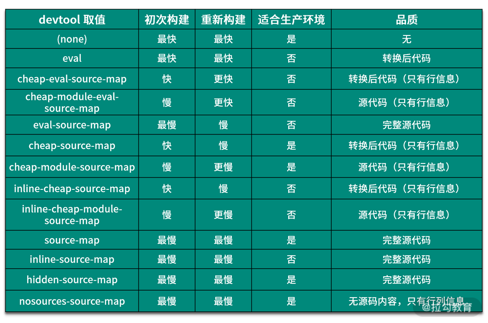

# 如何使用 Webpack Dev Server 提高本地开发效率？

webpack-dev-server 提供了一个开发服务器，并且将自动编译和自动刷新浏览器等一系列对开发友好的功能全部集成在了一起

运行 webpack-dev-server 这个命令时，它内部会启动一个 HTTP Server，为打包的结果提供静态文件服务，并且自动使用 Webpack 打包我们的应用，然后监听源代码的变化，一旦文件发生变化，它会立即重新打包

webpack-dev-server为了提高工作效率。它并没有将打包结果写入磁盘中，而是暂时存放在了内存当中，内部的HTTP Server也是从内存读取这些文件的，这样一来，就会减少很多不必要的磁盘读写操作，大大提高了整体的构建效率

## 一、webpack-dev-server 的常用功能

1. 静态资源访问 - contentBase

webpack-dev-server 默认会将构建结果和输出文件全部作为开发服务器的资源文件，也就是说，只要通过webpack打包就能够输出的文件都可以直接被访问到，但是有一些没有被打包的静态资源文件也需要做为开发服务器的资源被访问，那就需要配置webpack-dev-server

```js
module.exports = {
  devServer: {
    contentBase: 'public'
  }
}
```

区别于`copy-webpack-plugin`，开发阶段打包构建会很频繁不需要将copy的文件每一次都执行这个插件，打包开销会比较大，构建的速度也会降低，所以通常在开发阶段配置`webpack-dev-serve`r的`contentBase`即可

2. proxy代理解决跨域请求的问题
   
```js
module.exports = {
  devServer: {
    proxy: {
      '/api': {
        target: 'https://api.github.com'
      }
    }
  }
}
``` 

## 二、Webpack 中 SourceMap 配置的最佳实践

source map：映射转换后的代码与代码之间的关系。一段转换后的代码，通过转换过程中生成的source map文件就可以逆向解析得到对应的源代码

```js
module.exports = {
  devtool: 'source-map' // source map 设置
}
```



### 1、eval模式

在`eval`模式下，`webpack`会将每一个模块转换过后的代码都放到`eval`函数当中执行，并且通过`sourceURL`声明对应的文件路径的方式，这样浏览器就能知道某一行代码到底是在源代码的哪个文件中了。

优点： 构建速度快

缺点： 没有打包出`.map`文件，只能定位到源代码的文件路径，无法知道具体的行列信息

### 2、 cheap-eval-source-map

简易版的`eval-source-map`

优点：生成了 Source Map 文件，构建速度较快

缺点：这种模式下的 Source Map 只能定位到行，而定位不到列，定位的源代码是经过 ES6 转换后的结果

### 3、cheap-module-eval-source-map 

在cheap-eval-source-map 的基础上多了一个 module

优点：生成了 Source Map 文件，构建速度较快

缺点：这种模式下的 Source Map 只能定位到行，而定位不到列，定位的源代码是编写的源代码

### 4、 cheap-source-map

这个模式的名字中没有 eval，意味着它没用 eval 执行代码，而名字中没有 module，意味着 Source Map 反推出来的是 Loader 处理后的代码，有 cheap 表示只能定位源代码的行号。

### 5、inline-source-map

它跟普通的 source-map 效果相同，只不过这种模式下 Source Map 文件不是以物理文件存在，而是以 data URLs 的方式出现在代码中。我们前面遇到的 eval-source-map 也是这种 inline 的方式

### 6、hidden-source-map

在这个模式下，我们在开发工具中看不到 Source Map 的效果，但是它也确实生成了 Source Map 文件，这就跟 jQuery 一样，虽然生成了 Source Map 文件，但是代码中并没有引用对应的 Source Map 文件，开发者可以自己选择使用。

### 7、nosources-source-map 

在这个模式下，我们能看到错误出现的位置（包含行列位置），但是点进去却看不到源代码。这是为了保护源代码在生产环境中不暴露。


**面试题：开发过程中（开发环境）选择webpack的devtools的什么模式**

> 我会选择cheap-module-eval-source-map，原因主要有以下3点：
> 第一是因为代码通常会采用框架进行书写，无论是jsx或者是vue单文件，Loader转换之后差别都比较大，我需要调试Loader转换之前的代码
> 第二是因为编写的代码每行都有字数控制，所以只要能够定位行即可，而且省略信息还可以提升构建速度
> 第三是虽然在这种模式之下启动打包会比较慢，但是通常在开发阶段都是使用webpack-dev-server在监听的模式下重新打包的，所以它的打包速度很快，不会受到太大的影响

**面试题：生产过程中（生产环境）选择webpack的devtools的什么模式**

> 在web端开发我会选择none模式或者nosources-source-map，在桌面端开发就会选择cheap-module-eval-source-map，原因也比较简单
> 首先，Source Map 会暴露我的源代码到生产环境。如果没有控制 Source Map 文件访问权限的话，但凡是有点技术的人都可以很容易的复原项目中涉及的绝大多数源代码，这非常不合理也不安全
> 其次，调试应该是开发阶段的事情，在开发阶段就尽可能找到所有问题和隐患，而不是到了生产环境中再去测试